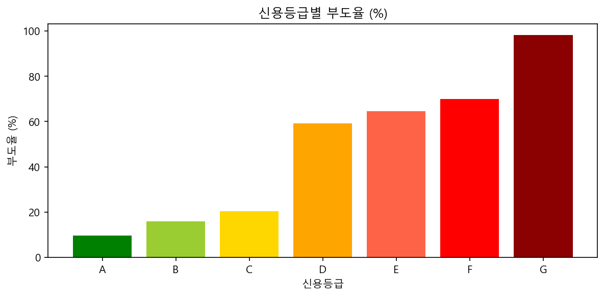
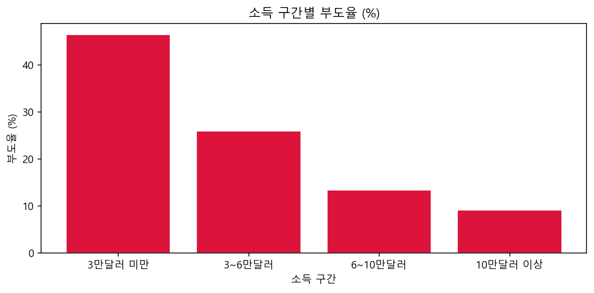

# 대출 데이터 SQL 분석 | Loan Data SQL Analysis

**SQL(SQLite) 및 Python 기반 대출 데이터 전처리 및 연체 위험군 분석** **Analyzing loan datasets using SQL and Python to identify high-risk segments and default patterns.**

---

## 프로젝트 개요 | Overview

본 프로젝트는 비즈니스 도메인 지식을 바탕으로 실무 데이터베이스 환경(Relational Database)에서 SQL을 활용해 데이터를 정규화하고, 대출 부도 위험이 높은 고객 세그먼트를 도출하는 과정을 구현했습니다. 특히 저신용군 및 고위험 고객군에 대한 복합 필터링을 통해 리스크 관리 인사이트를 확보했습니다.

Out of the dataset, severe risk factors were identified by joining `customers` and `loans` tables. This analysis focuses on providing actionable insights for credit risk management in a banking environment.

---

## 데이터 | Data

- **출처 | Source**: Kaggle - Credit Risk Dataset
- **전체 데이터 | Total Records**: 약 28,000건 (전처리 후 기준)
- **테이블 구성 | Schema**:
    - `customers`: 고객 기본 정보 (나이, 소득, 주거 형태, 근속 연수 등)
    - `loans`: 대출 상세 정보 (금액, 목적, 등급, 이자율, 부도 여부 등)

---

## 분석 과정 | Process

### 1단계 | Step 1: 데이터베이스 모델링 및 구축
- **정규화(Normalization)**: `customers`와 `loans` 테이블로 분리하여 데이터 중복 제거 및 무결성 확보
- **데이터 통합**: Python 연동을 통해 원천 CSV 데이터를 SQLite DB 내 각 테이블로 자동 삽입

### 2단계 | Step 2: SQL 기반 핵심 지표 분석
- **신용 등급별 분석**: 등급(A~G)에 따른 부도율 및 평균 이자율 산출로 등급 체계 유효성 검증
- **소득 구간별 분석**: 고객 소득 수준과 대출 승인/연체 간의 상관관계 파악
- **대출 목적별 분석**: 목적에 따른 부도 위험도 비교 분석

### 3단계 | Step 3: 고위험 고객 추출 (High-Risk Filtering)

| 분석 항목 | 세부 필터링 조건 | 기대 효과 |
|:---:|:---|:---|
| **저신용군** | 신용 등급 D, E, F, G | 잠재적 부도 위험군 집중 관리 |
| **고금리** | 대출 이자율 15% 초과 | 상환 부담이 높은 고객 식별 |
| **과다채무** | 소득 대비 대출 비중(DTI) 30% 초과 | 채무 불이행 가능성 선별 |
| **이력관리** | 과거 부도 이력 보유 (Default History: 'Y') | 반복 부도 리스크 차단 |

---

## 결론 | Conclusion

- **리스크 관리 최적화**: 신용 등급이 낮아질수록 부도율이 비선형적으로 급증함을 확인하여 최저 등급(G등급)에 대한 대출 심사 강화 필요성 도출
- **소득-부도 상관관계**: 연 소득 3만 달러 미만 저소득층의 부도율이 가장 높으며, 소득 수준과 상환 안정성 간의 명확한 상관관계 확인
- **전략적 제안**: 과거 부도 이력이 있는 저신용군 중 DTI가 높은 고객을 '집중 모니터링 대상'으로 선정하는 자동 필터링 시스템 제안

---

## 사용 기술 | Tech Stack

